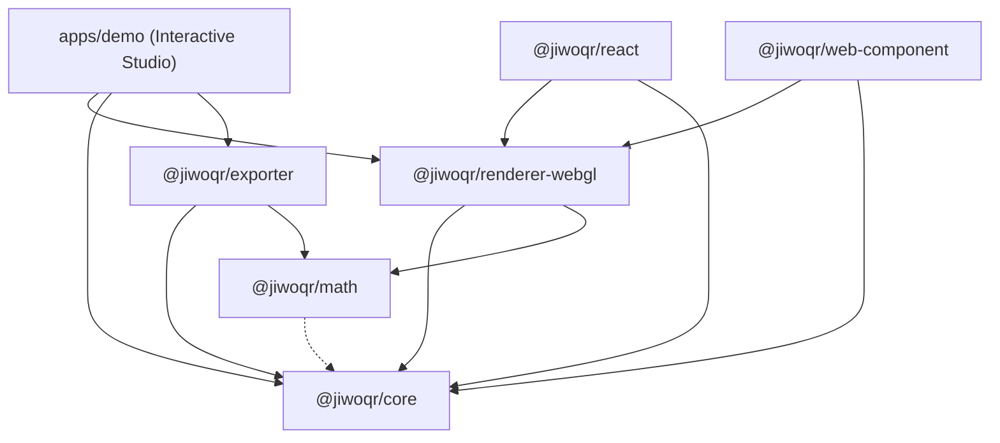

# 🌐 JiwoQR

> **Next-Generation Procedural 3D QR Code Ecosystem**  
> *Transforming functional 2D barcodes into deterministic 3D architectural worlds, voxel globes & microchip PCB circuits without sacrificing scannability.*

[](https://www.typescriptlang.org/)
[](https://threejs.org/)
[](https://pnpm.io/)
[](https://vitest.dev/)
[](https://www.iso.org/standard/62021.html)

---

## 📖 Daftar Isi

- [Tentang JiwoQR](#-tentang-jiwoqr)
- [Fitur Utama & Keunggulan](#-fitur-utama--keunggulan)
- [Arketipe Visual 3D](#-arketipe-visual-3d)
  - [1. Model Arsitektur (Architecture Model)](#1-model-arsitektur-architecture-model)
  - [2. Model Bola Voxel (Globe Model)](#2-model-bola-voxel-globe-model)
  - [3. Model Sirkuit Elektronik (Circuit Model)](#3-model-sirkuit-elektronik-circuit-model)
- [Jaminan Scannability & Transisi Dual-Mode](#-jaminan-scannability--transisi-dual-mode)
- [Mesin Ekspor 3D & Cetak 2D (@jiwoqr/exporter)](#-mesin-ekspor-3d--cetak-2d-jiwoqrexporter)
- [Zero-WebGL Graceful Fallback](#-zero-webgl-graceful-fallback)
- [Sensor Giroskop Mobile (Holographic Tilt)](#-sensor-giroskop-mobile-holographic-tilt)
- [Struktur Monorepo](#-struktur-monorepo)
- [Diagram Dependensi Paket](#-diagram-dependensi-paket)
- [Panduan Instalasi & Menjalankan Proyek](#-panduan-instalasi--menjalankan-proyek)
- [Quick Start: Integrasi Cepat](#-quick-start-integrasi-cepat)
  - [1. Menggunakan Vanilla WebGL Engine](#1-menggunakan-vanilla-webgl-engine)
  - [2. Menggunakan Komponen React](#2-menggunakan-komponen-react)
  - [3. Menggunakan Web Component (Custom Element)](#3-menggunakan-web-component-custom-element)
  - [4. Menggunakan Mesin Ekspor 3D/2D](#4-menggunakan-mesin-ekspor-3d2d)
- [Dasar Algoritma & Fondasi Matematika](#-dasar-algoritma--fondasi-matematika)
- [Daftar Dokumentasi Paket](#-daftar-dokumentasi-paket)
- [Kontribusi & Lisensi](#-kontribusi--lisensi)

---

## 🌟 Tentang JiwoQR

**JiwoQR** adalah ekosistem generasi baru untuk menghasilkan QR code 3D prosedural yang sepenuhnya interaktif dan deterministik. Dikembangkan dengan arsitektur monorepo modern, JiwoQR menggabungkan keindahan estetika *cyber-brutalist skyscraper*, *dual-hemisphere voxel mound globe*, dan *cybernetic microchip PCB circuit* dengan kepatuhan penuh terhadap standar internasional **ISO/IEC 18004**.

Tidak seperti generator QR artistik konvensional berbasis difusi gambar (AI image generation) yang seringkali merusak integritas *Reed-Solomon Error Correction*, JiwoQR beroperasi pada level matematika bitstream kanonikal:
1. **100% Deterministic DNA**: Setiap payload/URL menghasilkan struktur kota, bola voxel, atau komponen PCB yang unik namun konsisten setiap kali dirender.
2. **Smooth 60 FPS Morphing**: Transisi mulus antara eksplorasi 3D bebas (orbit kamera, pencahayaan dramatis) dan mode pemindaian 2D datar (*perpendicular camera, zero-distortion, high binary contrast*).
3. **Multi-Platform Ready**: Tersedia sebagai engine WebGL murni, komponen React siap pakai, serta Custom Element native tanpa dependensi framework dengan fallback otomatis ke Canvas 2D.

---

## ✨ Fitur Utama & Keunggulan

- **Deterministic Visual DNA**:
  - Hashing string/URL menggunakan algoritma **FNV-1a 64-bit** yang cepat dan bebas tabrakan berlebih.
  - Pseudo-Random Number Generator (PRNG) **Mulberry32** untuk membangkitkan palet warna harmonis, profil ketinggian modul, dan arketipe landmark.
- **Standar Penuh ISO/IEC 18004 & Multi-Mode Encoding**:
  - Kompresi multi-mode dengan deteksi otomatis (`auto`, `numeric`, `alphanumeric`, `byte`).
  - Mode numerik memadatkan 3 digit ke 10 bit; mode alfanumerik memadatkan 2 karakter ke 11 bit ($c_1 \times 45 + c_2$).
  - Aritmatika Galois Field $\text{GF}(2^{8})$ dan perhitungan polinomial **Reed-Solomon ECC** level L (~7%), M (~15%), Q (~25%), dan H (~30%).
  - Zona tenang (*Quiet Zone*) wajib 4 modul di sekeliling matriks QR.
  - Klasifikasi semantik setiap modul (`FINDER`, `ALIGNMENT`, `TIMING`, `DARK`, `DATA`, `QUIET`).
- **High-Performance Instanced Rendering**:
  - Menggunakan Three.js `InstancedMesh` dengan `DynamicDrawUsage` untuk rendering ribuan blok 3D dalam single draw call pada 60 FPS.
- **Shadow & Lighting Mitigation**:
  - Secara otomatis mereduksi intensitas directional shadow, mematikan bayangan keras, dan menginterpolasi substrate plate menjadi putih bersih saat bertransisi ke Mode Scan untuk menjamin kamera smartphone dapat membaca barcode secara instan.
- **3D Printing & Print-Ready Export Engine**:
  - Generator mesh biner `.stl` yang 100% *watertight/manifold* dengan elevasi prosedural sesuai model 3D aktif (gedung bertingkat, gundukan kubah bola, chip SMD).
  - Ekspor 3D scene `.glb` Three.js, vector `.svg` mandiri, dan raster `.png` 300 DPI ultra-tajam.

---

## 🏛️ Arketipe Visual 3D

JiwoQR menyediakan tiga model visual utama yang dapat diganti secara dinamis:

### 1. Model Arsitektur (`model="architecture"`)
Menyusun modul-modul gelap matriks QR menjadi lanskap kota metropolitan *cyber-brutalist*.
- **Landmark Finder Towers**: Pola finder di ketiga sudut QR diekstrusi menjadi menara pencakar langit tertinggi dengan aksen pendaran (*emissive glow*).
- **Procedural Cityscape**: Modul data diekstrusi menjadi gedung-gedung dengan variasi ketinggian dan palet warna prosedural.
- **Substrate Plate**: Pelat dasar yang mencakup QR code beserta 4-modul quiet zone.

```
       [Finder Tower]                [Finder Tower]
         ┌─────────┐                   ┌─────────┐
         │  █████  │   [City Blocks]   │  █████  │
         │  █   █  │   ┌──┐ ┌──┐ ┌──┐  │  █   █  │
         │  █████  │   │  │ │  │ │  │  │  █████  │
         └─────────┘   └──┘ └──┘ └──┘  └─────────┘
                       ══════════════
                      [Substrate Plate]
```

### 2. Model Bola Voxel (`model="globe"`)
Menyusun modul-modul QR menjadi gundukan voxel 3D dual-hemisfer yang menyerupai planet mini atau medan medan kontinental (*voxel terrain mound*).
- **Dual-Hemisphere Mound Architecture**: Dua kubah voxel (Kubah A di $+Z$ dan Kubah B di $-Z$) bertemu di bidang ekuator $Z = 0$, membentuk bola voxel 3D tanpa pelat yang membelah di mode 3D.
- **Elevation-Based Gradient**: Gradasi warna kontinental dari terracotta/substrate di lingkar ekuator, biru/ungu di elevasi menengah, hingga aksen emas/krem pada puncak kutub.
- **Planar Flattening Morph**: Kubah atas merata menjadi matriks 2D kanonikal, kubah bawah menyusut di bawah pelat putih, dan pelat substrate putih memudar masuk secara mulus saat beralih ke Mode Scan.

### 3. Model Sirkuit Elektronik (`model="circuit"`)
Menyusun matriks QR menjadi motherboard sirkuit cetak (*Cybernetic PCB / Microchip Core*).
- **Microprocessor IC Finders**: Tiga Finder Patterns dirender sebagai chip prosesor utama (*Main QFP/BGA IC package*) dengan pin logam di sekelilingnya.
- **SMD Components & Traces**: Modul data bernilai `1` dirender sebagai komponen elektronik SMD (resistor 0805, kapasitor keramik, solder via pad emas) dan jalur konduktor tembaga (*traces*) di atas plat PCB *solder mask* hijau tua/hitam matte.
- **Circuit Scan Melting**: Saat transisi ke Scan Mode ($t \to 1.0$), seluruh komponen elektronik, pin, dan jalur konduktor melebur rata menjadi modul biner pekat berdaya kontras tinggi.

---

## 🎯 Jaminan Scannability & Transisi Dual-Mode

| Parameter | Mode 3D Interaktif (`mode="3d"`) | Mode Scan 2D (`mode="scan"`) |
| :--- | :--- | :--- |
| **Perspektif Kamera** | Orbit 3D bebas, elevasi dramatis | Tegak lurus (perpendicular top-down) |
| **Ketinggian Modul ($Z$)** | Bervariasi ($0.2\times$ hingga $1.75\times$ maxHeight) | Datar tipis ($Z = 0.02$) |
| **Warna Modul** | Palet DNA (Primary, Secondary, Emissive) | Hitam pekat murni (`#000000`) |
| **Substrate Plate** | Warna tema gelap atau transparan | Putih solid murni (`#FFFFFF`) |
| **Pencahayaan & Bayangan** | Directional Light + PCF Soft Shadows aktif | Ambient Light $1.0\times$, bayangan dinonaktifkan |
| **Quiet Zone** | 4-modul terintegrasi secara proporsional | 4-modul kontras tinggi (ISO/IEC 18004) |

---

## 🖨️ Mesin Ekspor 3D & Cetak 2D (`@jiwoqr/exporter`)

Paket `@jiwoqr/exporter` memungkinkan hasil pembuatan QR 3D diubah menjadi aset fisik dan digital:
1. **Binary STL (`exportSTL`)**: Menghasilkan file `.stl` siap cetak 3D untuk slicer (Cura, PrusaSlicer, Bambu Studio, OrcaSlicer) dengan elevasi balok data prosedural sesuai model 3D aktif.
2. **Binary GLB (`exportGLB`)**: Mengekspor seluruh Three.js Scene ke format standar `.glb` lengkap dengan geometri instanced dan material PBR.
3. **Print-Ready PNG 300 DPI (`exportPNG`)**: Merender gambar raster beresolusi ultra-tinggi ($2048\times2048+$) tanpa anti-aliasing kabur untuk kebutuhan cetak kartu nama, stiker, dan kemasan produk.
4. **Vector SVG (`exportSVG`)**: Format vektor murni yang dapat di-scale tak terbatas tanpa kehilangan ketajaman.

---

## 🛡️ Zero-WebGL Graceful Fallback

Jika aplikasi dijalankan pada browser atau perangkat lawas yang tidak mendukung akselerasi WebGL, komponen `<JiwoQR />` (React) dan `<jiwo-qr>` (Web Component) secara otomatis mendeteksi ketiadaan WebGL dan beralih ke rendering Canvas 2D murni (`render2DFallbackCanvas`). Hal ini menjamin QR code tetap tampil dan dapat dipindai dalam kondisi lingkungan apa pun.

---

## 📱 Sensor Giroskop Mobile (Holographic Tilt)

Di perangkat smartphone atau tablet dengan sensor orientasi (`DeviceOrientationEvent`), JiwoQR menyediakan fitur **Holographic Tilt** via `cameraController.applyGyroTilt(gamma, beta)`. Pengguna cukup memiringkan ponsel untuk melihat efek kedalaman 3D paralaks holografik secara real-time.

---

## 📦 Struktur Monorepo

```
jiwoQR/
├── apps/
│   └── demo/                      # Interactive 3D QR Studio (Vite + TS)
├── packages/
│   ├── core/                      # Multi-mode encoder, RS ECC, DNA generator
│   ├── math/                      # Vektor, easing, ekstrusi, spherical & circuit projections
│   ├── renderer-webgl/            # Three.js engine, models (Architecture, Globe, Circuit), fallback
│   ├── exporter/                  # 3D mesh (GLB, watertight STL) & 2D print (SVG, PNG 300 DPI)
│   ├── react/                     # Komponen wrapper <JiwoQR /> untuk React dengan WebGL fallback
│   ├── web-component/             # Native Custom Element <jiwo-qr> dengan WebGL fallback
│   └── renderer-webgpu/           # Scaffolding & type definition WebGPU masa depan
├── package.json                   # Root package manifest & scripts
├── pnpm-workspace.yaml            # Konfigurasi workspace monorepo
├── tsconfig.base.json             # Konfigurasi TypeScript global
└── update_tracker.md              # Log audit perubahan file & rekayasa teknis
```

---

## 🔄 Diagram Dependensi Paket



---

## 🚀 Panduan Instalasi & Menjalankan Proyek

### Prasyarat
- [Node.js](https://nodejs.org/) v18.0.0 atau lebih baru.
- [pnpm](https://pnpm.io/) v9.0.0 / v12.0.0 atau lebih baru.

### 1. Kloning dan Instalasi Dependensi
```bash
git clone https://github.com/y7thangeru/jiwoQR.git
cd jiwoQR
pnpm install
```

### 2. Membangun Seluruh Paket (Build)
```bash
pnpm build
```

### 3. Menjalankan Pengujian Unit (Unit Tests)
```bash
pnpm test
```

### 4. Menjalankan Typecheck TypeScript
```bash
pnpm typecheck
```

### 5. Menjalankan Studio Demo Interaktif
```bash
pnpm dev
```
Buka peramban di `http://localhost:5173` untuk mengakses **JiwoQR Interactive Studio**.

---

## 💻 Quick Start: Integrasi Cepat

### 1. Menggunakan Vanilla WebGL Engine

Instal paket yang dibutuhkan:
```bash
pnpm add @jiwoqr/core @jiwoqr/renderer-webgl three
```

Implementasi TypeScript:
```typescript
import { JiwoWebGLRenderer } from '@jiwoqr/renderer-webgl';

// Inisialisasi renderer di dalam container DOM
const container = document.getElementById('qr-container')!;
const renderer = new JiwoWebGLRenderer({
  container,
  model: 'circuit',     // 'architecture' | 'globe' | 'circuit'
  mode: '3d',           // '3d' | 'scan'
  morphDuration: 800,   // durasi transisi dalam ms
});

// Set data URL atau string payload
renderer.setData('https://jiwoqr.dev');

// Beralih ke scan mode secara dinamis
document.getElementById('btn-scan')?.addEventListener('click', () => {
  renderer.setMode('scan');
});
```

---

### 2. Menggunakan Komponen React

Instal paket React:
```bash
pnpm add @jiwoqr/react @jiwoqr/renderer-webgl three
```

Implementasi komponen React:
```tsx
import React, { useState } from 'react';
import { JiwoQR } from '@jiwoqr/react';

export const QRCodeWidget: React.FC = () => {
  const [isScanMode, setIsScanMode] = useState(false);
  const [model, setModel] = useState<'architecture' | 'globe' | 'circuit'>('circuit');

  return (
    <div style={{ width: 480, height: 480, position: 'relative' }}>
      <JiwoQR
        value="https://jiwoqr.dev"
        model={model}
        mode={isScanMode ? 'scan' : '3d'}
        morphDuration={800}
      />
      
      <div style={{ position: 'absolute', bottom: 16, left: 16, display: 'flex', gap: 8 }}>
        <button onClick={() => setModel(m => m === 'circuit' ? 'globe' : 'circuit')}>
          Ganti Model ({model})
        </button>
        <button onClick={() => setIsScanMode(s => !s)}>
          {isScanMode ? 'Kembali ke 3D' : 'Mode Scan'}
        </button>
      </div>
    </div>
  );
};
```

---

### 3. Menggunakan Web Component (Custom Element)

Instal paket web component:
```bash
pnpm add @jiwoqr/web-component @jiwoqr/renderer-webgl three
```

Integrasi langsung di HTML:
```html
<!DOCTYPE html>
<html lang="id">
<head>
  <script type="module" src="./node_modules/@jiwoqr/web-component/dist/index.js"></script>
  <style>
    jiwo-qr {
      width: 500px;
      height: 500px;
      border-radius: 12px;
      overflow: hidden;
    }
  </style>
</head>
<body>
  <jiwo-qr 
    value="https://jiwoqr.dev" 
    model="circuit" 
    mode="3d">
  </jiwo-qr>

  <script>
    const qrElement = document.querySelector('jiwo-qr');
    // qrElement.setMode('scan');
  </script>
</body>
</html>
```

---

### 4. Menggunakan Mesin Ekspor 3D/2D

```typescript
import { createJiwoQR } from '@jiwoqr/core';
import { exportSTL, exportPNG, downloadFile } from '@jiwoqr/exporter';

const entity = createJiwoQR('https://jiwoqr.dev');

// 1. Ekspor STL 3D Print Watertight
const stlBuffer = exportSTL(entity.matrix, {
  dna: entity.dna,
  model: 'architecture',
  moduleSize: 2.0,
  baseThickness: 2.0,
});
downloadFile(stlBuffer, 'jiwo-qr-architecture.stl', 'application/sla');

// 2. Ekspor PNG 300 DPI Cetak Fisik
const pngBlob = await exportPNG(entity.matrix, { size: 2048 });
downloadFile(pngBlob, 'jiwo-qr-300dpi.png', 'image/png');
```

---

## 📐 Dasar Algoritma & Fondasi Matematika

### 1. Hashing Deterministik FNV-1a 64-bit
Setiap karakter dari input $S$ yang telah dinormalisasi diproses secara sekuensial dengan formula:
$$\text{hash} \leftarrow (\text{hash} \oplus c) \times \text{FNV\_PRIME} \pmod{2^{64}}$$
di mana $\text{FNV\_OFFSET\_BASIS} = \text{0xcbf29ce484222325n}$ dan $\text{FNV\_PRIME} = \text{0x100000001b3n}$.

### 2. Generator Ketinggian Mound Dome Model Globe
Modul-modul pada model Globe diekstrusi dari bidang ekuator $Z = 0$ mengikuti kurva bola setengah lingkaran:
$$H(x, y) = H_{\text{max}} \times \sqrt{\max\left(0, 1 - \left(\frac{\text{dist}(x, y)}{R_{\text{max}}}\right)^2\right)}$$
Menghasilkan struktur gundukan voxel 3D yang mulus dan membulat secara alami sebelum bertransisi menjadi bidang 2D datar.

---

## 📚 Daftar Dokumentasi Paket

Untuk dokumentasi teknis mendalam per paket, silakan kunjungi:
- [`@jiwoqr/core` Documentation](file:///d:/REPOS/jiwoQR/packages/core/README.md) - Multi-mode bitstream encoder, Galois Field RS-ECC, and Deterministic DNA.
- [`@jiwoqr/math` Documentation](file:///d:/REPOS/jiwoQR/packages/math/README.md) - Extrusions, spherical projections, circuit projections, and easing curves.
- [`@jiwoqr/renderer-webgl` Documentation](file:///d:/REPOS/jiwoQR/packages/renderer-webgl/README.md) - Three.js WebGL engine, models (Architecture, Globe, Circuit), fallback & gyro controls.
- [`@jiwoqr/exporter` Documentation](file:///d:/REPOS/jiwoQR/packages/exporter/README.md) - 3D mesh (GLB, watertight STL) & 2D print (SVG, PNG 300 DPI) export engine.
- [`@jiwoqr/react` Documentation](file:///d:/REPOS/jiwoQR/packages/react/README.md) - React component wrapper with WebGL fallback.
- [`@jiwoqr/web-component` Documentation](file:///d:/REPOS/jiwoQR/packages/web-component/README.md) - Framework-agnostic `<jiwo-qr>` Custom Element.
- [`@jiwoqr/renderer-webgpu` Documentation](file:///d:/REPOS/jiwoQR/packages/renderer-webgpu/README.md) - Next-generation WebGPU compute pipeline contracts.
- [`apps/demo` Documentation](file:///d:/REPOS/jiwoQR/apps/demo/README.md) - Interactive 3D QR Studio & Telemetry HUD.

---

## 🤝 Kontribusi & Lisensi

Proyek ini berada di bawah lisensi MIT. Silakan buka *Issues* atau ajukan *Pull Requests* untuk mendiskusikan peningkatan fitur dan optimasi rendering.
