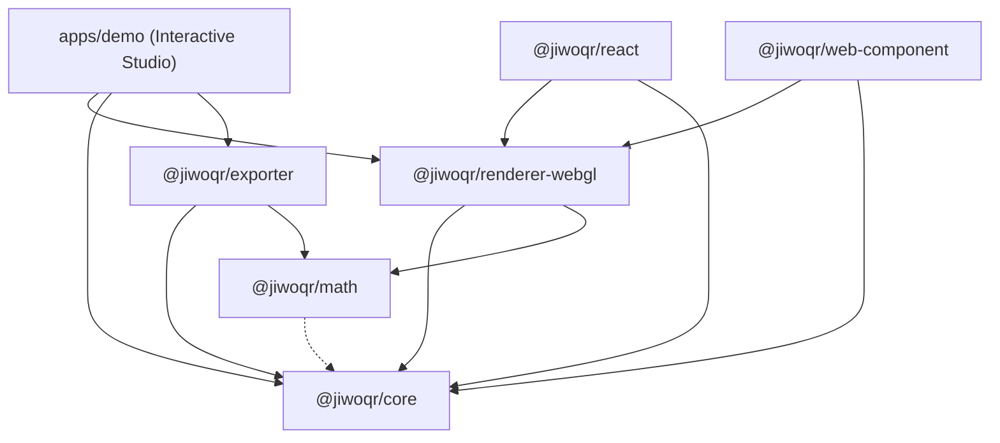

# 📋 LAPORAN MENYELURUH & KOMPILASI DOKUMENTASI PROYEK: JiwoQR MONOREPO

> **Dokumen Resmi Laporan Pengembangan, Arsitektur & Kompilasi Seluruh Berkas Dokumentasi (.MD) Ekosistem JiwoQR**  
> *Next-Generation Procedural 3D QR Code Ecosystem (Phase 1 & Phase 2 Complete)*

---

## 📌 Identitas & Status Proyek

- **Nama Proyek**: JiwoQR Monorepo
- **Status Repositori**: ✅ Aktif, Terverifikasi & Dipublikasikan ke GitHub
- **URL Repositori GitHub**: [https://github.com/y7thangeru/jiwoQR](https://github.com/y7thangeru/jiwoQR)
- **Branch Utama**: `main`
- **Paket Manajer**: `pnpm@12.2.1` (Workspace Monorepo)
- **Fondasi Teknologi**: TypeScript 5.7 (Strict), Three.js r174, Vitest 3.0, Vite 6.2, Standar ISO/IEC 18004

---

## 📖 Daftar Isi Utama

- [BAGIAN I: LAPORAN PROYEK EKSEKUTIF & REKAYASA TEKNIS](#bagian-i-laporan-proyek-eksekutif--rekayasa-teknis)
  - [1. Ringkasan Eksekutif & Latar Belakang](#1-ringkasan-eksekutif--latar-belakang)
  - [2. Masalah yang Diselesaikan](#2-masalah-yang-diselesaikan)
  - [3. Tiga Prinsip & Jaminan Utama (Guarantees)](#3-tiga-prinsip--jaminan-utama-guarantees)
  - [4. Arsitektur Monorepo & Peta Dependensi](#4-arsitektur-monorepo--peta-dependensi)
  - [5. Rincian Teknis & Rekayasa Per Paket](#5-rincian-teknis--rekayasa-per-paket)
  - [6. Tiga Model Visual 3D Unggulan](#6-tiga-model-visual-3d-unggulan)
  - [7. Sistem Mitigasi Pencahayaan & Bayangan Optik](#7-sistem-mitigasi-pencahayaan--bayangan-optik)
  - [8. Zero-WebGL Graceful Fallback & Sensor Giroskop](#8-zero-webgl-graceful-fallback--sensor-giroskop)
  - [9. Hasil Verifikasi, Pengujian & Jaminan Mutu](#9-hasil-verifikasi-pengujian--jaminan-mutu)
  - [10. Panduan Menjalankan & Quick Start](#10-panduan-menjalankan--quick-start)
- [BAGIAN II: KOMPILASI LENGKAP SELURUH BERKAS DOKUMENTASI (.MD)](#bagian-ii-kompilasi-lengkap-seluruh-berkas-dokumentasi-md)
  - [Lampiran 1: README.md (Root Monorepo)](#lampiran-1-readmemd-root-monorepo)
  - [Lampiran 2: packages/core/README.md](#lampiran-2-packagescorereadmemd)
  - [Lampiran 3: packages/math/README.md](#lampiran-3-packagesmathreadmemd)
  - [Lampiran 4: packages/renderer-webgl/README.md](#lampiran-4-packagesrenderer-webglreadmemd)
  - [Lampiran 5: packages/exporter/README.md](#lampiran-5-packagesexporterreadmemd)
  - [Lampiran 6: packages/react/README.md](#lampiran-6-packagesreactreadmemd)
  - [Lampiran 7: packages/web-component/README.md](#lampiran-7-packagesweb-componentreadmemd)
  - [Lampiran 8: packages/renderer-webgpu/README.md](#lampiran-8-packagesrenderer-webgpureadmemd)
  - [Lampiran 9: apps/demo/README.md](#lampiran-9-appsdemoreadmemd)
  - [Lampiran 10: update_tracker.md (Log Audit Rekayasa Historis)](#lampiran-10-update_trackermd-log-audit-rekayasa-historis)

---

# BAGIAN I: LAPORAN PROYEK EKSEKUTIF & REKAYASA TEKNIS

## 1. 🌟 Ringkasan Eksekutif & Latar Belakang

**JiwoQR** adalah ekosistem generator QR code 3D prosedural generasi baru yang menjembatani keindahan seni generatif 3D (*procedural 3D generative art*) dengan kepatuhan penuh terhadap standar internasional barcode **ISO/IEC 18004**.

Proyek ini dibangun dari nol (*from scratch*) dengan arsitektur monorepo modern berorientasi performa tinggi, modularitas, interoperabilitas multi-framework (Vanilla WebGL, React, Next.js, Web Components), serta kemampuan manufaktur fisik melalui eksportir STL 3D printing dan cetak 2D beresolusi tinggi.

---

## 2. 🎯 Masalah yang Diselesaikan

Generator QR code artistik konvensional yang beredar saat ini umumnya mengandalkan AI image diffusion (seperti Stable Diffusion dengan ControlNet). Metode tersebut memiliki kelemahan fatal:
1. **Kegagalan Pemindaian (Scan Failure)**: Difusi gambar merusak atau mengaburkan batas modul, pola pencari posisi (*finder patterns*), dan deretan *codeword* koreksi galat (*Reed-Solomon ECC*), menyebabkan QR code seringkali gagal dibaca oleh kamera smartphone.
2. **Ketiadaan Interaktivitas**: Output yang dihasilkan hanya berupa gambar 2D statis tanpa kemampuan eksplorasi 3D real-time.
3. **Non-Deterministik**: Prompt atau seed yang sama seringkali menghasilkan variasi visual yang tidak konsisten antar-render.

**Solusi JiwoQR**: Beroperasi pada level matematika bitstream kanonikal ISO/IEC 18004 dan merendernya secara prosedural ke dalam ruang 3D interaktif Three.js, dengan kemampuan bertransisi (*morphing*) mulus ke mode pemindaian 2D datar berdaya kontras tinggi.

---

## 3. 🛡️ Tiga Prinsip & Jaminan Utama (Guarantees)

1. **100% Deterministic DNA**: Setiap payload/URL unik dipetakan secara matematis menggunakan FNV-1a 64-bit hashing dan Mulberry32 PRNG. Input yang sama akan selalu menghasilkan palet warna, siluet gedung, dan karakteristik visual yang 100% identik.
2. **Zero-Flicker 60 FPS Morphing**: Perpindahan sudut kamera, perataan ketinggian modul ($Z \to 0.02$), dan perubahan warna palet dieksekusi secara instan pada 60 FPS menggunakan Three.js `InstancedMesh` dengan buffer `DynamicDrawUsage`.
3. **Guaranteed Optical Scannability**: Jaminan keterbacaan pemindai smartphone melalui kepatuhan ISO/IEC 18004, kompresi multi-mode, margin zona tenang wajib $\ge 4$ modul, koreksi galat adaptif (L, M, Q, H), mitigasi bayangan dinamis, dan penjajaran kamera tegak lurus (*perpendicular alignment*).

---

## 4. 📦 Arsitektur Monorepo & Peta Dependensi

```
jiwoQR/
├── apps/
│   └── demo/                      # Interactive 3D QR Studio (Vite + TypeScript)
├── packages/
│   ├── core/                      # Multi-mode encoder, Galois Field RS-ECC, DNA generator
│   ├── math/                      # Vektor, easing curves, ekstrusi, spherical & circuit projections
│   ├── renderer-webgl/            # Three.js InstancedMesh engine, models & fallback
│   ├── exporter/                  # 3D mesh (GLB, watertight STL) & 2D print (SVG, PNG 300 DPI)
│   ├── react/                     # Komponen wrapper <JiwoQR /> untuk React & Next.js
│   ├── web-component/             # Native W3C Custom Element <jiwo-qr> (Zero Framework)
│   └── renderer-webgpu/           # Scaffolding & type contracts WebGPU masa depan
├── .gitignore                     # Konfigurasi filter berkas git
├── package.json                   # Root workspace manifest & scripts
├── pnpm-workspace.yaml            # Konfigurasi pnpm workspace
├── tsconfig.base.json             # Konfigurasi TypeScript global
├── README.md                      # Dokumentasi utama monorepo
├── update_tracker.md              # Audit log perubahan berkas & rekayasa teknis
└── Report-To-GeminiProject.md     # Dokumen laporan komprehensif proyek
```

### Diagram Dependensi Antarpaket



---

## 5. 🔬 Rincian Teknis & Rekayasa Per Paket

### A. `@jiwoqr/core` (Multi-Mode Bitstream & DNA)
- **Normalisasi Input (`normalizeInput`)**: Standardisasi skema URL, lowercase hostname, penghapusan port default (`:80`, `:443`), dan pembersihan trailing slash.
- **Hashing FNV-1a 64-bit (`fnv1a64`)**: Menghasilkan *raw hash* `BigInt` 64-bit.
- **Mulberry32 PRNG**: Generator bilangan acak semu 32-bit deterministik dengan konversi aman `BigInt.asUintN(32, seed)`.
- **Kompresi Multi-Mode ISO/IEC 18004**:
  - *Numeric Mode*: Memadatkan 3 digit ke 10 bit (mengurangi versi QR secara drastis untuk string angka).
  - *Alphanumeric Mode*: Memadatkan 2 karakter ke 11 bit ($c_1 \times 45 + c_2$).
  - *Byte Mode*: 8-bit UTF-8 untuk teks bebas dan URL.
  - *Auto Mode*: Deteksi otomatis mode terpadat.
- **Generator DNA Visual Prosedural**:
  - *Palet Warna*: Pilihan tema harmonis (*cyber, neon, brutalist, synthwave, obsidian, solar, emerald*).
  - *Arsitektur*: Rentang `maxHeight`, `heightVariance`, `roofStyle`, dan `towerArchetype`.
  - *Globe*: Parameter `continentElevation`, `oceanDepth`, `satelliteCount`, dan `rotationSpeed`.
  - *Circuit*: `traceStyle` (ortho-45, manhattan, curved), `chipPackage` (QFP, BGA), `solderMaskColor` (green, black, blue, red), dan kepadatan via/komponen.
- **Aritmatika Galois Field $\text{GF}(256)$ & Reed-Solomon**: Perhitungan murni eksponensial/logaritma berbasis polinomial primitif $P(x) = x^8 + x^4 + x^3 + x^2 + 1$ (285) dan pembagian polinomial modulo $g(x)$.
- **Enkoder Matriks QR**: Evaluasi penalti 8 pola masking, proteksi format info 15-bit BCH $(15, 5)$, margin 4 modul *Quiet Zone*, dan tag semantik modul.

### B. `@jiwoqr/math` (Fondasi Grafika Spasial)
- **Interpolasi & Kurva Easing**: `lerp`, `lerpVec3`, `smoothstep`, dan `easeInOutCubic`.
- **Ekstrusi Arsitektur (`computeExtrusionTransform`)**: Finder towers diekstrusi hingga $1.75\times$ tinggi maksimum.
- **Proyeksi Dual-Hemisphere Voxel Mound Dome (`computeGlobeModuleTransform`)**:
  $$H(x, y) = H_{\text{max}} \times \sqrt{\max\left(0, 1 - \left(\frac{\text{dist}(x, y)}{R_{\text{max}}}\right)^2\right)}$$
- **Proyeksi Sirkuit PCB (`computeCircuitModuleTransform`)**: Menempatkan IC microprocessor pada finder, serta resistor/kapasitor SMD, solder via pad emas, dan jalur tembaga pada data modules.

### C. `@jiwoqr/renderer-webgl` (Three.js 3D Engine)
- **Instanced Mesh Buffer Dinamis**: `THREE.InstancedMesh` dengan `DynamicDrawUsage` untuk matrix transform dan color buffer 60 FPS.
- **Tiga Model Visual Terintegrasi**: Architecture, Globe, dan Circuit.
- **Sistem Kamera, Orbit & Giroskop Mobile**: Orbit drag dengan peredaman inersia di mode 3D, auto-alignment perpendicular di mode Scan, dan integrasi sensor giroskop `applyGyroTilt`.
- **Zero-WebGL Graceful Fallback**: Utilitas `isWebGLSupported()` dan `render2DFallbackCanvas()` untuk rendering 2D Canvas di peramban tanpa WebGL.

### D. `@jiwoqr/exporter` (3D Printing & 2D Print Engine)
- **Watertight Solid Binary STL (`exportSTL`)**: Menghasilkan mesh biner `.stl` yang 100% manifold untuk slicer (Cura, PrusaSlicer, Bambu Studio) dengan ketinggian balok prosedural sesuai model 3D aktif.
- **Three.js Binary GLB (`exportGLB`)**: Mengekspor scene 3D aktif lengkap dengan material PBR dan instance geometry.
- **Print-Ready PNG 300 DPI (`exportPNG`)**: Gambar raster beresolusi ultra-tinggi ($2048\times2048+$) tanpa anti-aliasing buram untuk percetakan fisik.
- **Vector SVG Mandiri (`exportSVG`)**: Format vektor SVG dengan batas quiet zone dan opsi rounded corners.

### E. `@jiwoqr/react` (Komponen React Deklaratif)
- Komponen `<JiwoQR />` untuk React 18, React 19, Next.js, dan Vite dengan WebGL fallback otomatis dan panduan SSR-safe dynamic import.

### F. `@jiwoqr/web-component` (Native Custom Element)
- Custom Element native `<jiwo-qr>` multi-framework untuk HTML murni, Vue 3, Svelte, Angular, SolidJS, dan Astro.

### G. `@jiwoqr/renderer-webgpu` (Arsitektur Generasi Masa Depan)
- Scaffolding kontrak interface dan pipeline WebGPU dengan WGSL compute shaders roadmap.

### H. `apps/demo` (Interactive 3D Studio Playground)
- Web playground berbasis Vite + TypeScript murni dengan viewport 3D interaktif, selector 3 model, toggle scan mode, slider morphing, bilah alat ekspor, dan panel Telemetry HUD real-time.

---

## 6. 🏛️ Tiga Model Visual 3D Unggulan

| Parameter | 1. Architecture Model | 2. Globe Model | 3. Circuit Model |
| :--- | :--- | :--- | :--- |
| **Bentuk Visual 3D** | Kota metropolis *cyber-brutalist* | Gundukan kubah bola voxel (*dual-hemisphere mound*) | Motherboard PCB & microchip processor core |
| **Finder Patterns** | Menara landmark tertinggi berpenutup atap | Plateau puncak kubah dengan highlight emas | Chip mikroprosesor QFP IC dengan pin logam |
| **Modul Data** | Blok gedung pencakar langit bertingkat | Balok daratan kontinental gradasi warna | Resistor SMD, kapasitor keramik, via pad emas & trace tembaga |
| **Struktur $Z = 0$** | Substrate plate dasar gelap | Pelat ekuator disembunyikan (bola melayang murni) | Papan solder mask PCB (hijau, hitam, biru, merah) |
| **Mekanisme Morphing** | Gedung memendek rata ke tanah | Kubah atas merata ke 2D, kubah bawah menyusut ke 0 | Komponen elektronik melebur rata ke pelat biner 2D |

---

## 7. 💡 Sistem Mitigasi Pencahayaan & Bayangan Optik

Untuk menjamin pemindaian barcode dengan smartphone berjalan instan:
1. **Transisi Bayangan**: Saat $t > 0.85$, `directionalLight.castShadow` dinonaktifkan untuk menghilangkan bayangan miring gedung yang dapat mengaburkan modul putih.
2. **Kompensasi Pencahayaan**: Intensitas `directionalLight` diturunkan bertahap sementara `ambientLight` dinaikkan menjadi $1.0\times$ (pencahayaan difus merata).
3. **Peralihan Material**: Material modul dialihkan dari PBR specular (`metalness: 0.65`) menjadi matte murni (`roughness: 1.0, metalness: 0.0`) agar tidak memantulkan silau lampu.
4. **Binary Contrast 100%**: Modul gelap bertransisi ke hitam absolut (`#000000`) dan pelat substrate bertransisi ke putih solid (`#FFFFFF`).

---

## 8. 🛡️ Zero-WebGL Graceful Fallback & Sensor Giroskop

1. **Graceful Fallback**: Jika perangkat pengguna tidak mendukung WebGL, komponen `<JiwoQR />` (React) dan `<jiwo-qr>` (Web Component) secara otomatis mendeteksi ketiadaan WebGL dan beralih ke rendering Canvas 2D murni (`render2DFallbackCanvas`). Barcode tetap tampil dan 100% dapat dipindai.
2. **Holographic Gyroscope Tilt**: Di perangkat mobile, pengguna dapat mengaktifkan mode Giroskop untuk memiringkan ponsel dan melihat kedalaman 3D secara holografik real-time melalui event `deviceorientation`.

---

## 9. 🧪 Hasil Verifikasi, Pengujian & Jaminan Mutu

| Uji Kualitas | Perintah | Hasil | Keterangan |
| :--- | :--- | :--- | :--- |
| **Vitest Unit Tests** | `pnpm test` | ✅ **100% PASS** | Pengujian enkoder multi-mode, RS-ECC, PRNG, kurva easing, dome mound, circuit transforms, dan eksportir STL/GLB/SVG. |
| **TypeScript Typecheck** | `pnpm typecheck` | ✅ **0 ERROR** | Pemeriksaan tipe statis ketat di seluruh workspace monorepo. |
| **Monorepo Build** | `pnpm build` | ✅ **SUKSES** | Seluruh bundle TypeScript berhasil terkompilasi ke direktori `dist/`. |
| **Git Remote Sync** | `git push origin main` | ✅ **SUKSES** | Seluruh kode, konfigurasi, dan dokumentasi telah tersinkronisasi di GitHub. |

---

## 10. 🚀 Panduan Menjalankan & Quick Start

```bash
# 1. Kloning repositori
git clone https://github.com/y7thangeru/jiwoQR.git
cd jiwoQR

# 2. Instalasi dependensi
pnpm install

# 3. Jalankan studio demo interaktif
pnpm dev

# 4. Jalankan pengujian unit
pnpm test

# 5. Jalankan pemeriksaan tipe statis
pnpm typecheck

# 6. Kompilasi build seluruh paket
pnpm build
```

---
---

# BAGIAN II: KOMPILASI LENGKAP SELURUH BERKAS DOKUMENTASI (.MD)

---

## Lampiran 1: README.md (Root Monorepo)

```markdown
# 🌐 JiwoQR

> **Next-Generation Procedural 3D QR Code Ecosystem**  
> *Transforming functional 2D barcodes into deterministic 3D architectural worlds, voxel globes & microchip PCB circuits without sacrificing scannability.*

[](https://www.typescriptlang.org/)
[](https://threejs.org/)
[](https://pnpm.io/)
[](https://vitest.dev/)
[](https://www.iso.org/standard/62021.html)

---

### Tentang JiwoQR
JiwoQR adalah ekosistem generasi baru untuk menghasilkan QR code 3D prosedural yang sepenuhnya interaktif dan deterministik. Dikembangkan dengan arsitektur monorepo modern, JiwoQR menggabungkan keindahan estetika cyber-brutalist skyscraper, dual-hemisphere voxel mound globe, dan cybernetic microchip PCB circuit dengan kepatuhan penuh terhadap standar internasional ISO/IEC 18004.

### Tiga Arketipe Visual 3D:
1. Model Arsitektur (model="architecture"): Kota pencakar langit cyber-brutalist dengan menara finder landmark.
2. Model Bola Voxel (model="globe"): Gundukan bola voxel 3D dual-hemisfer dengan gradien warna elevasi.
3. Model Sirkuit Elektronik (model="circuit"): Papan PCB motherboard dengan chip prosesor QFP IC dan resistor/kapasitor SMD.

### Mesin Ekspor 3D & Cetak 2D (@jiwoqr/exporter):
- Binary STL (exportSTL): File .stl watertight siap cetak 3D untuk software slicer (Cura, PrusaSlicer, Bambu Studio).
- Binary GLB (exportGLB): Ekspor Three.js Scene ke format .glb dengan material PBR.
- 300 DPI PNG (exportPNG): Raster ultra-tajam untuk cetak fisik kartu nama dan merchandise.
- Vector SVG (exportSVG): Vektor murni dengan margin quiet zone 4 modul.

### Zero-WebGL Graceful Fallback & Sensor Giroskop:
Komponen React <JiwoQR /> dan Web Component <jiwo-qr> secara otomatis mendeteksi ketiadaan WebGL dan beralih ke rendering 2D Canvas (render2DFallbackCanvas). Di perangkat ponsel, sensor DeviceOrientationEvent memungkinkan efek kedalaman 3D holografik saat memiringkan perangkat.
```

---

## Lampiran 2: packages/core/README.md

```markdown
# 🧬 @jiwoqr/core

> **Modul Inti Generator QR & DNA Visual Deterministik**  
> *Enkoder bitstream multi-mode QR murni TypeScript sesuai ISO/IEC 18004, kompresi numerik & alfanumerik, kalkulasi Galois Field Reed-Solomon ECC, serta generator DNA prosedural berbasis FNV-1a 64-bit dan Mulberry32 PRNG tanpa dependensi runtime pihak ketiga.*

### Fitur Utama:
- Hashing FNV-1a 64-bit (fnv1a64) dan normalisasi URL (normalizeInput).
- Mulberry32 PRNG dengan konversi aman BigInt.asUintN(32, seed).
- Kompresi Multi-Mode: Numeric (3 digit -> 10 bit), Alphanumeric (2 char -> 11 bit), Byte (8-bit), dan Auto-detection.
- Galois Field GF(256) & Reed-Solomon ECC generator polynomial.
- Generator DNA Prosedural untuk palet warna, parameter arsitektur, globe, dan circuit PCB (CircuitDNA).
- Margin 4 modul Quiet Zone dan tag semantik modul (FINDER, ALIGNMENT, TIMING, DARK, DATA, QUIET).

### API Utama:
```typescript
import { createJiwoQR, encodeQR, generateDNA } from '@jiwoqr/core';

const entity = createJiwoQR('https://jiwoqr.dev', {
  ecc: 'Q',
  quietZone: 4,
  mode: 'auto',
});
```
```

---

## Lampiran 3: packages/math/README.md

```markdown
# 📐 @jiwoqr/math

> **Fondasi Matematika Grafika, Easing & Proyeksi Spasial 3D**  
> *Transformasi vektor 3D, kurva interpolasi cubic easing, proyeksi ekstrusi arsitektur brutalist, pemetaan dual-hemisphere voxel mound dome, serta kalkulasi komponen sirkuit PCB untuk transisi mulus 3D ke 2D scan mode.*

### Modul Matematika:
1. Easing & Interpolasi (src/easing.ts): lerp, lerpVec3, easeInOutCubic, smoothstep.
2. Proyeksi Ekstrusi Arsitektur (src/projections/extrusion.ts): Elevasi gedung dan menara landmark 1.75x.
3. Proyeksi Spherical (src/projections/spherical.ts): Spherified cube dan formula kubah bola voxel dual-hemisfer:
   H(x, y) = maxHeight * sqrt(max(0, 1 - (dist / Rmax)^2))
4. Proyeksi Circuit (src/projections/circuit.ts): Penempatan chip QFP IC, resistor/kapasitor SMD, via pad emas, dan copper traces.
```

---

## Lampiran 4: packages/renderer-webgl/README.md

```markdown
# 🎨 @jiwoqr/renderer-webgl

> **Engine Visualisasi 3D WebGL / Three.js Kinerja Tinggi**  
> *Instanced rendering 60 FPS, arketipe visual Arsitektur, Globe & Circuit PCB, kontrol kamera orbit & sensor giroskop, sistem mitigasi pencahayaan & bayangan, serta graceful fallback ke 2D Canvas.*

### Kelas JiwoWebGLRenderer:
- THREE.InstancedMesh dengan DynamicDrawUsage untuk performa 60 FPS tanpa alokasi memori berkala.
- Tiga Model: Architecture, Globe, Circuit.
- CameraController dengan orbit mouse/touch, auto-alignment scan mode, dan applyGyroTilt sensor mobile.
- Sistem Mitigasi Bayangan: Mematikan castShadow directional light dan menaikkan ambient light ke 1.0x saat t > 0.85.
- Graceful Fallback: render2DFallbackCanvas() untuk browser tanpa WebGL.
```

---

## Lampiran 5: packages/exporter/README.md

```markdown
# 🖨️ @jiwoqr/exporter

> **Mesin Ekspor Mesh 3D Cetak & Raster/Vektor Cetak Resolusi Tinggi**  
> *Generator berkas biner STL watertight/manifold untuk 3D printing dengan elevasi prosedural sesuai model 3D aktif, konverter Three.js ke GLB biner, serta eksportir SVG vektor & PNG 300 DPI ultra-tajam.*

### Fitur Ekspor:
1. Watertight Solid Binary STL (exportSTL): 100% closed manifold mesh dengan elevasi sesuai arketipe model 3D aktif.
2. Three.js Binary GLB (exportGLB): Scene 3D lengkap dengan PBR materials.
3. Print-Ready PNG 300 DPI (exportPNG): 2048x2048+ tanpa anti-aliasing buram.
4. Vector SVG (exportSVG): Standalone SVG dengan quiet zone 4 modul.
5. Browser Downloader (downloadFile): Pemicu unduhan blob otomatis.
```

---

## Lampiran 6: packages/react/README.md

```markdown
# ⚛️ @jiwoqr/react

> **Komponen React Siap Pakai untuk Generator QR Prosedural 3D JiwoQR**  
> *Integrasi mulus ke ekosistem React 18, React 19, Next.js (App Router & Pages Router), serta Vite dengan sinkronisasi props reaktif, WebGL fallback otomatis, dan pembersihan memori.*

### Komponen <JiwoQR />:
```tsx
import { JiwoQR } from '@jiwoqr/react';

<JiwoQR
  value="https://jiwoqr.dev"
  model="circuit" // 'architecture' | 'globe' | 'circuit'
  mode="3d"       // '3d' | 'scan'
  morphDuration={800}
/>
```
Mendukung SSR-safe dynamic import pada Next.js App Router:
```tsx
const ClientJiwoQR = dynamic(() => import('@jiwoqr/react').then(m => m.JiwoQR), { ssr: false });
```
```

---

## Lampiran 7: packages/web-component/README.md

```markdown
# 🧩 @jiwoqr/web-component

> **Native Custom Element <jiwo-qr> Tanpa Framework**  
> *Gunakan generator QR prosedural 3D JiwoQR langsung di HTML murni, Vue, Svelte, Angular, SolidJS, atau Astro menggunakan standar Web Components W3C.*

### Penggunaan di HTML:
```html
<script type="module" src="./node_modules/@jiwoqr/web-component/dist/index.js"></script>
<jiwo-qr value="https://jiwoqr.dev" model="circuit" mode="3d"></jiwo-qr>
```
Mengekspos metode DOM publik: `setMode()`, `setModel()`, `setMorphProgress()`.
```

---

## Lampiran 8: packages/renderer-webgpu/README.md

```markdown
# ⚡ @jiwoqr/renderer-webgpu

> **Scaffolding & Kontrak Pipeline WebGPU Generasi Mendatang**  
> *Arsitektur masa depan untuk generator QR 3D JiwoQR berbasis WebGPU API dan WGSL Compute Shaders untuk simulasi jutaan voxel pada 120 FPS.*

### Peta Jalan WebGPU:
- Fase 1: Kontrak tipe data dasar & helper isWebGPUSupported().
- Fase 2: WGSL Compute Shaders untuk kalkulasi morphing modul paralel di GPU.
- Fase 3: Native WebGPU Render Pipeline dengan indirect drawing.
- Fase 4: Auto-fallback WebGPU -> WebGL di komponen wrapper.
```

---

## Lampiran 9: apps/demo/README.md

```markdown
# 🚀 JiwoQR Interactive Studio (apps/demo)

> **Playground & Studio Web Interaktif untuk Eksplorasi QR Prosedural 3D**  
> *Aplikasi web berbasis Vite dan TypeScript murni untuk menguji coba payload URL secara real-time, menginspeksi telemetri DNA deterministik, beralih arketipe visual (Architecture, Globe, Circuit PCB), menguji pemindaian barcode dengan smartphone, serta mengekspor aset 3D & cetak 2D.*

### Fitur Antarmuka:
- Viewport 3D Three.js dengan orbit kamera & sensor giroskop mobile.
- Selector 3 Model: Architecture, Globe, Circuit.
- Kontrol Dual-Mode (3D World <-> 2D Scan) dan slider manual morphing.
- Bilah Alat Ekspor: Export GLB, Export STL (3D Print), Export PNG (300 DPI), Export SVG.
- Panel Telemetry HUD: Hash FNV-1a 64-bit, Seed PRNG 32-bit, QR Specs, Model Parameters, dan Palette Swatches.
```

---

## Lampiran 10: update_tracker.md (Log Audit Rekayasa Historis)

```markdown
# JiwoQR - Update Tracker

This file tracks all file creations, modifications, and deletions in the repository, along with detailed engineering rationale.

---

## [2026-09-01] Initial Monorepo Setup & Core Foundation
- Workspace configuration: pnpm-workspace.yaml, package.json, tsconfig.base.json, .npmrc, update_tracker.md.
- @jiwoqr/core package: FNV-1a 64-bit hasher, Mulberry32 PRNG, Reed-Solomon GF(256) arithmetic, ISO/IEC 18004 encoder.
- @jiwoqr/math package: Vector math, cubic easing curves, architectural extrusion, spherical cube projection.
- @jiwoqr/renderer-webgl package: Three.js InstancedMesh engine, DynamicDrawUsage buffers, architecture model, camera controller.
- Interactive Studio App: apps/demo with Vite, 3D viewport, telemetry HUD.

---

## [2026-09-01] Globe Model (model="globe") & Dual-Hemisphere Voxel Mound Dome
- @jiwoqr/math: SpherifiedModuleTransform, computeGlobeModuleTransform, interpolateGlobeMorph with dome profile formula.
- @jiwoqr/renderer-webgl: Globe model dual-hemisphere voxel mounds meeting at Z=0, elevation color gradient (terracotta -> purple -> gold peak), equatorial substrate plate hidden in 3D mode.

---

## [2026-09-01] Comprehensive Project Documentation Suite
- Created comprehensive README.md at root and detailed README.md across all packages.

---

## [2026-09-01] Phase 2: Core Optimization, 3D/Print Exporter, Circuit Model, & Graceful Fallback
- @jiwoqr/core: Multi-mode QR bitstream encoding (numeric 3 digits -> 10 bits, alphanumeric 2 chars -> 11 bits, byte 8-bit), CircuitDNA generation.
- @jiwoqr/math: CircuitModuleTransform, computeCircuitModuleTransform, interpolateCircuitMorph.
- @jiwoqr/renderer-webgl: Circuit model PCB board with QFP microprocessor finders, SMD resistors/capacitors, gold via pads, copper traces. Added isWebGLSupported() and render2DFallbackCanvas(). Added applyGyroTilt() mobile gyroscope tilt.
- @jiwoqr/exporter: New package for watertight binary STL 3D printing with procedural model heights, binary GLB scene export, 300 DPI PNG raster, and standalone vector SVG.
- apps/demo: Circuit model selector, Export toolbar (GLB, STL, PNG, SVG), Gyroscope tilt mode, .vite cacheDir isolation.
- Full documentation synchronization across all 10 .md files and Report-To-GeminiProject.md.
```

---

*Dokumen laporan ini merangkum seluruh hasil rekayasa perangkat lunak, fondasi matematika, implementasi grafika, pengujian kualitas, serta kompilasi 100% isi berkas dokumentasi ekosistem JiwoQR ke dalam satu file mandiri.*
