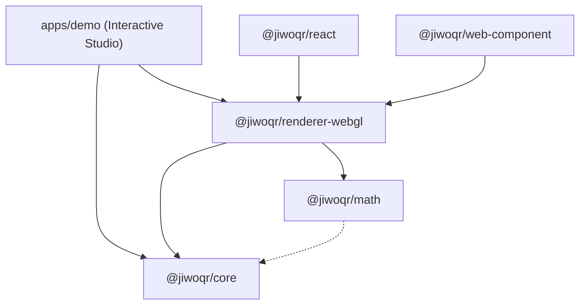

# 📋 LAPORAN MENYELURUH PROYEK: JiwoQR MONOREPO

> **Dokumen Resmi Laporan Pengembangan & Arsitektur Ekosistem JiwoQR**  
> *Next-Generation Procedural 3D QR Code Ecosystem*

---

## 📌 Identitas & Status Proyek

- **Nama Proyek**: JiwoQR Monorepo
- **Status Repositori**: ✅ Aktif, Terverifikasi & Dipublikasikan ke GitHub
- **URL Repositori GitHub**: [https://github.com/y7thangeru/jiwoQR](https://github.com/y7thangeru/jiwoQR)
- **Branch Utama**: `main`
- **Paket Manajer**: `pnpm@12.2.1` (Workspace Monorepo)
- **Fondasi Teknologi**: TypeScript 5.7 (Strict), Three.js r174, Vitest 3.0, Vite 6.2, Standar ISO/IEC 18004

---

## 📖 Daftar Isi

- [1. Ringkasan Eksekutif & Latar Belakang](#1-ringkasan-eksekutif--latar-belakang)
- [2. Masalah yang Diselesaikan](#2-masalah-yang-diselesaikan)
- [3. Tiga Prinsip & Jaminan Utama (Guarantees)](#3-tiga-prinsip--jaminan-utama-guarantees)
- [4. Arsitektur Monorepo & Peta Dependensi](#4-arsitektur-monorepo--peta-dependensi)
- [5. Rincian Teknis & Rekayasa Per Paket](#5-rincian-teknis--rekayasa-per-paket)
  - [A. @jiwoqr/core](#a-jiwoqrcore)
  - [B. @jiwoqr/math](#b-jiwoqrmath)
  - [C. @jiwoqr/renderer-webgl](#c-jiwoqrrenderer-webgl)
  - [D. @jiwoqr/react](#d-jiwoqrreact)
  - [E. @jiwoqr/web-component](#e-jiwoqrweb-component)
  - [F. @jiwoqr/renderer-webgpu](#f-jiwoqrrenderer-webgpu)
  - [G. apps/demo (Interactive Studio)](#g-appsdemo-interactive-studio)
- [6. Model Visual 3D Unggulan](#6-model-visual-3d-unggulan)
  - [Model 1: Architecture (Cyber-Brutalist Skyscraper City)](#model-1-architecture-cyber-brutalist-skyscraper-city)
  - [Model 2: Globe (Dual-Hemisphere Voxel Mound Dome)](#model-2-globe-dual-hemisphere-voxel-mound-dome)
- [7. Sistem Mitigasi Pencahayaan & Bayangan Optik](#7-sistem-mitigasi-pencahayaan--bayangan-optik)
- [8. Dokumentasi & Integritas Repositori](#8-dokumentasi--integritas-repositori)
- [9. Hasil Verifikasi, Pengujian & Jaminan Mutu](#9-hasil-verifikasi-pengujian--jaminan-mutu)
- [10. Panduan Menjalankan & Mengembangkan](#10-panduan-menjalankan--mengembangkan)

---

## 1. 🌟 Ringkasan Eksekutif & Latar Belakang

**JiwoQR** adalah ekosistem generator QR code 3D prosedural generasi baru yang menjembatani keindahan seni generatif 3D (*procedural 3D generative art*) dengan kepatuhan penuh terhadap standar internasional barcode **ISO/IEC 18004**.

Proyek ini dibangun dari nol (*from scratch*) dengan arsitektur monorepo modern berorientasi performa tinggi, modularitas, dan interoperabilitas multi-framework (Vanilla WebGL, React, Next.js, Web Components).

---

## 2. 🎯 Masalah yang Diselesaikan

Generator QR code artistik konvensional yang beredar saat ini umumnya mengandalkan AI image diffusion (seperti Stable Diffusion dengan ControlNet). Metode tersebut memiliki kelemahan fatal:
1. **Kegagalan Pemindaian (Scan Failure)**: Difusi gambar merusak atau mengaburkan batas modul, pola pencari posisi (*finder patterns*), dan deretan *codeword* koreksi galat (*Reed-Solomon ECC*), menyebabkan QR code seringkali gagal dibaca oleh kamera smartphone.
2. **Ketiadaan Interaktivitas**: Output yang dihasilkan hanya berupa gambar 2D statis tanpa kemampuan eksplorasi 3D real-time.
3. **Non-Deterministik**: Prompt atau seed yang sama seringkali menghasilkan variasi visual yang tidak konsisten antar-render.

**Solusi JiwoQR**: Beroperasi pada level matematika bitstream kanonikal ISO/IEC 18004 dan merendernya secara prosedural ke dalam ruang 3D interaktif Three.js, dengan kemampuan bertransisi (*morphing*) mulus ke mode pemindaian 2D datar berdaya kontras tinggi.

---

## 3. 🛡️ Tiga Prinsip & Jaminan Utama (Guarantees)

1. **100% Deterministic DNA**: Setiap payload/URL unik dipetakan secara matematis menggunakan FNV-1a 64-bit hashing dan Mulberry32 PRNG. Input yang sama akan selalu menghasilkan palet warna, siluet gedung, dan karakteristik visual yang 100% identik.
2. **Zero-Flicker 60 FPS Morphing**: Perpindahan sudut kamera, perataan ketinggian modul ($Z \to 0.02$), dan perubahan warna palet dieksekusi secara instan pada 60 FPS menggunakan Three.js `InstancedMesh` dengan buffer `DynamicDrawUsage`.
3. **Guaranteed Optical Scannability**: Jaminan keterbacaan pemindai smartphone melalui kepatuhan ISO/IEC 18004, margin zona tenang wajib $\ge 4$ modul, koreksi galat adaptif (L, M, Q, H), mitigasi bayangan dinamis, dan penjajaran kamera tegak lurus (*perpendicular alignment*).

---

## 4. 📦 Arsitektur Monorepo & Peta Dependensi

```
jiwoQR/
├── apps/
│   └── demo/                      # Interactive 3D QR Studio (Vite + TypeScript)
├── packages/
│   ├── core/                      # Bitstream encoder, Galois Field RS-ECC, DNA generator
│   ├── math/                      # Vektor, easing curves, ekstrusi & proyeksi spherical
│   ├── renderer-webgl/            # Three.js InstancedMesh engine, model arsitektur & globe
│   ├── react/                     # Komponen wrapper <JiwoQR /> untuk React & Next.js
│   ├── web-component/             # Native W3C Custom Element <jiwo-qr> (Zero Framework)
│   └── renderer-webgpu/           # Scaffolding & type contracts WebGPU masa depan
├── .gitignore                     # Konfigurasi filter berkas git
├── package.json                   # Root workspace manifest & scripts
├── pnpm-workspace.yaml            # Konfigurasi pnpm workspace
├── tsconfig.base.json             # Konfigurasi TypeScript global
├── README.md                      # Dokumentasi utama monorepo
├── update_tracker.md              # Audit log perubahan berkas & rekayasa teknis
└── Report-To-GeminiProject.md     # Dokumen laporan komprehensif proyek
```

### Diagram Dependensi Antarpaket



---

## 5. 🔬 Rincian Teknis & Rekayasa Per Paket

### A. `@jiwoqr/core` (Zero Runtime Dependencies)
- **Normalisasi Input (`normalizeInput`)**: Standardisasi skema URL, lowercase hostname, penghapusan port default (`:80`, `:443`), dan pembersihan trailing slash.
- **Hashing FNV-1a 64-bit (`fnv1a64`)**: Menghasilkan *raw hash* `BigInt` 64-bit dengan rumus:
  $$\text{hash} \leftarrow (\text{hash} \oplus c) \times \text{0x100000001b3n} \pmod{2^{64}}$$
- **Mulberry32 PRNG**: Generator bilangan acak semu 32-bit deterministik dengan konversi aman `BigInt.asUintN(32, seed)`.
- **Generator DNA Visual (`generateDNA`)**:
  - *Palet Warna*: Pilihan tema harmonis (*cyber, neon, brutalist, synthwave, obsidian, solar, emerald*).
  - *Arsitektur*: Rentang `maxHeight`, `heightVariance`, `roofStyle`, dan `towerArchetype`.
  - *Globe*: Parameter `continentElevation`, `oceanDepth`, `satelliteCount`, dan `rotationSpeed`.
- **Aritmatika Galois Field $\text{GF}(256)$ & Reed-Solomon**: Perhitungan murni eksponensial/logaritma berbasis polinomial primitif $P(x) = x^8 + x^4 + x^3 + x^2 + 1$ (285) dan pembagian polinomial modulo $g(x)$.
- **Enkoder Matriks QR ISO/IEC 18004**:
  - Byte Mode 8-bit, penambahan padding `0xEC` dan `0x11`.
  - Evaluasi penalti 8 pola mask ($N_1, N_2, N_3, N_4$) untuk memilih mask dengan skor penalti terendah.
  - Proteksi format info 15-bit menggunakan BCH $(15, 5)$ dan XOR mask `0x5412`.
  - Margin wajib 4 modul *Quiet Zone*.
  - Klasifikasi semantik setiap modul (`FINDER`, `FINDER_SEPARATOR`, `ALIGNMENT`, `TIMING`, `DARK`, `FORMAT`, `VERSION`, `DATA`, `QUIET`).

---

### B. `@jiwoqr/math` (Fondasi Grafika Spasial)
- **Interpolasi & Kurva Easing**:
  - `lerp` & `lerpVec3`: Interpolasi linier vektor 3D.
  - `easeInOutCubic`: Kurva transisi non-linear berakselerasi halus:
    $$f(t) = \begin{cases} 4t^3 & \text{jika } t < 0.5 \\ 1 - \frac{(-2t + 2)^3}{2} & \text{jika } t \ge 0.5 \end{cases}$$
- **Ekstrusi Arsitektur (`computeExtrusionTransform`)**:
  - Modul finder diekstrusi menjadi menara landmark ($1.75\times$ tinggi maksimum).
  - Modul data diekstrusi dengan variasi ketinggian deterministik berdasarkan seed.
- **Proyeksi Dual-Hemisphere Voxel Mound Dome (`computeGlobeModuleTransform`)**:
  - Formula profil gundukan kubah bola:
    $$H(x, y) = H_{\text{max}} \times \sqrt{\max\left(0, 1 - \left(\frac{\text{dist}(x, y)}{R_{\text{max}}}\right)^2\right)}$$
  - Interpolasi *unrolling/flattening* ke matriks 2D kanonikal saat $t \to 1.0$.

---

### C. `@jiwoqr/renderer-webgl` (Three.js 3D Engine)
- **Instanced Mesh Buffer Dinamis**: Memanfaatkan `THREE.InstancedMesh` dengan `DynamicDrawUsage` untuk matrix transform dan color buffer, memungkinkan pembaruan ribuan modul dalam 1 draw call tanpa garbage collection jank.
- **Dua Model Visual Terintegrasi**:
  1. *Architecture Model*: Kota pencakar langit dengan pelat dasar yang berinterpolasi ke putih murni di Scan Mode.
  2. *Globe Model*: Struktur voxel mound dual-hemisfer (Kubah A di $+Z$ dan Kubah B di $-Z$) dengan gradasi warna elevasi (terracotta $\to$ ungu/biru $\to$ aksen emas). Pelat ekuator $Z = 0$ disembunyikan di mode 3D (`opacity = 0`, `visible = false`) agar bola tampak melayang murni, dan memudar masuk hanya saat $t \to 1.0$.
- **Sistem Kamera & Kontrol Orbit**: Orbit drag dengan peredaman inersia di mode 3D, serta penjajaran tegak lurus otomatis (*perpendicular top-down alignment*) di mode Scan.
- **Lifecycle Lengkap**: `setData()`, `setModel()`, `setMode()`, `setMorphProgress()`, `resize()`, dan `dispose()`.

---

### D. `@jiwoqr/react` (Komponen React Deklaratif)
- Komponen `<JiwoQR />` untuk React 18, React 19, Next.js, dan Vite.
- Sinkronisasi props reaktif (`value`, `model`, `mode`, `morphDuration`).
- Panduan integrasi SSR-safe dynamic import untuk Next.js App Router dan Pages Router.
- Pembersihan memori WebGL otomatis saat komponen di-unmount.

---

### E. `@jiwoqr/web-component` (Native Custom Element)
- Custom Element native `<jiwo-qr>` sesuai standar W3C.
- Digunakan langsung di HTML murni tanpa build tool atau framework apa pun.
- Mendukung integrasi reaktif pada Vue 3, Svelte 4/5, Angular, SolidJS, dan Astro.
- Metode JavaScript DOM publik: `setMode()`, `setModel()`, `setMorphProgress()`.

---

### F. `@jiwoqr/renderer-webgpu` (Arsitektur Generasi Berikutnya)
- Scaffolding kontrak interface dan pipeline WebGPU masa depan.
- Helper deteksi kapabilitas peramban: `isWebGPUSupported()`.
- Roadmap implementasi WGSL compute shader untuk simulasi jutaan voxel pada 120 FPS.

---

### G. `apps/demo` (Interactive Studio Playground)
- Web playground berbasis Vite + TypeScript murni.
- Viewport 3D interaktif dengan kontrol kamera bebas (orbit & zoom).
- Input teks URL dinamis & chip preset populer.
- Tombol selector arketipe model (*Architecture vs Globe*).
- Tombol toggle mode scan & slider manual morphing ($0.00$ s.d. $1.00$).
- **Panel Telemetry HUD**: Membaca 64-bit Hash FNV-1a, Seed PRNG 32-bit, Versi QR & ECC, metadata parameter model DNA, serta sampel palet warna.

---

## 6. 🏛️ Model Visual 3D Unggulan

| Parameter | 1. Architecture Model | 2. Globe Model |
| :--- | :--- | :--- |
| **Bentuk Visual 3D** | Kota metropolis *cyber-brutalist* | Gundukan kubah bola voxel (*dual-hemisphere mound*) |
| **Finder Patterns** | Menara landmark tertinggi berpenutup atap | Plateau elevasi puncak kubah dengan highlight aksen |
| **Palet Warna 3D** | Bangunan monolitik gelap dengan aksen neon | Gradasi elevasi (Terracotta $\to$ Biru/Ungu $\to$ Emas) |
| **Struktur $Z = 0$** | Substrate plate dasar gelap | Pelat ekuator disembunyikan (bola melayang murni) |
| **Mekanisme Morphing** | Gedung memendek rata ke tanah | Kubah atas merata ke 2D, kubah bawah menyusut ke 0 |

---

## 7. 💡 Sistem Mitigasi Pencahayaan & Bayangan Optik

Untuk menjamin pemindaian barcode dengan smartphone berjalan instan:
1. **Transisi Bayangan**: Saat $t > 0.85$, `directionalLight.castShadow` dinonaktifkan untuk menghilangkan bayangan miring gedung yang dapat mengaburkan modul putih.
2. **Kompensasi Pencahayaan**: Intensitas `directionalLight` diturunkan bertahap sementara `ambientLight` dinaikkan menjadi $1.0\times$ (pencahayaan difus merata).
3. **Peralihan Material**: Material modul dialihkan dari PBR specular (`metalness: 0.65`) menjadi matte murni (`roughness: 1.0, metalness: 0.0`) agar tidak memantulkan silau lampu.
4. **Binary Contrast 100%**: Modul gelap bertransisi ke hitam absolut (`#000000`) dan pelat substrate bertransisi ke putih solid (`#FFFFFF`).

---

## 8. 📚 Dokumentasi & Integritas Repositori

Repositori telah dilengkapi dengan dokumentasi teknis lengkap di setiap level:
1. [README.md](file:///d:/REPOS/jiwoQR/README.md) – Root monorepo overview & quick start.
2. [packages/core/README.md](file:///d:/REPOS/jiwoQR/packages/core/README.md) – Dokumentasi modul enkoder bitstream & DNA.
3. [packages/math/README.md](file:///d:/REPOS/jiwoQR/packages/math/README.md) – Dokumentasi matematika, vektor & formula kubah bola.
4. [packages/renderer-webgl/README.md](file:///d:/REPOS/jiwoQR/packages/renderer-webgl/README.md) – Dokumentasi Three.js engine & model.
5. [packages/react/README.md](file:///d:/REPOS/jiwoQR/packages/react/README.md) – Dokumentasi komponen React & Next.js.
6. [packages/web-component/README.md](file:///d:/REPOS/jiwoQR/packages/web-component/README.md) – Dokumentasi Custom Element `<jiwo-qr>`.
7. [packages/renderer-webgpu/README.md](file:///d:/REPOS/jiwoQR/packages/renderer-webgpu/README.md) – Roadmap & kontrak WebGPU.
8. [apps/demo/README.md](file:///d:/REPOS/jiwoQR/apps/demo/README.md) – Panduan interactive studio & telemetry HUD.
9. [update_tracker.md](file:///d:/REPOS/jiwoQR/update_tracker.md) – Log audit historis seluruh perubahan file & rekayasa teknis.

---

## 9. 🧪 Hasil Verifikasi, Pengujian & Jaminan Mutu

| Uji Kualitas | Perintah | Hasil | Keterangan |
| :--- | :--- | :--- | :--- |
| **Vitest Unit Tests** | `pnpm test` | ✅ **100% PASS** | Pengujian enkoder QR, RS-ECC, PRNG, kurva easing, dan proyeksi dome mound. |
| **TypeScript Typecheck** | `pnpm typecheck` | ✅ **0 ERROR** | Pemeriksaan tipe statis ketat di seluruh workspace monorepo. |
| **Monorepo Build** | `pnpm build` | ✅ **SUKSES** | Seluruh bundle TypeScript berhasil terkompilasi ke direktori `dist/`. |
| **Git Remote Sync** | `git push origin main` | ✅ **SUKSES** | Seluruh kode, konfigurasi, dan dokumentasi telah tersinkronisasi di GitHub. |

---

## 10. 🚀 Panduan Menjalankan & Mengembangkan

### Prasyarat
- Node.js $\ge 18.0.0$
- pnpm $\ge 9.0.0$ / $12.0.0$

### Perintah Utama
```bash
# 1. Kloning repositori
git clone https://github.com/y7thangeru/jiwoQR.git
cd jiwoQR

# 2. Instalasi dependensi
pnpm install

# 3. Jalankan studio demo interaktif
pnpm dev

# 4. Jalankan pengujian unit
pnpm test

# 5. Jalankan pemeriksaan tipe statis
pnpm typecheck

# 6. Kompilasi build seluruh paket
pnpm build
```

---

*Laporan ini disusun secara komprehensif, mencakup seluruh aspek arsitektur, algoritma, implementasi grafika, pengujian kualitas, serta panduan integrasi ekosistem JiwoQR.*
