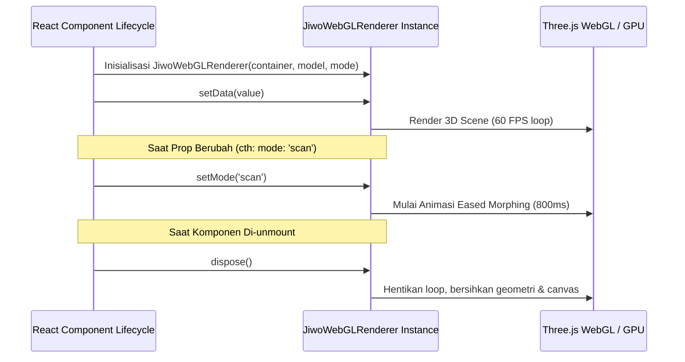

# ⚛️ @jiwoqr/react

> **Komponen React Siap Pakai untuk Generator QR Prosedural 3D JiwoQR**  
> *Integrasi mulus ke ekosistem React 18, React 19, Next.js (App Router & Pages Router), serta Vite dengan sinkronisasi props reaktif dan pembersihan memori otomatis.*

[](file:///d:/REPOS/jiwoQR/packages/react)
[](https://react.dev/)
[](file:///d:/REPOS/jiwoQR/packages/react/tsconfig.json)

---

## 📖 Daftar Isi

- [Gambaran Umum](#-gambaran-umum)
- [Instalasi](#-instalasi)
- [Referensi Props & Tipe Data](#-referensi-props--tipe-data)
- [Contoh Penggunaan Dasar](#-contoh-penggunaan-dasar)
- [Integrasi Framework](#-integrasi-framework)
  - [1. Next.js App Router (SSR-Safe Dynamic Import)](#1-nextjs-app-router-ssr-safe-dynamic-import)
  - [2. Next.js Pages Router](#2-nextjs-pages-router)
  - [3. Vite + React + Tailwind CSS](#3-vite--react--tailwind-css)
- [Manajemen Siklus Hidup & Sinkronisasi Props](#-manajemen-siklus-hidup--sinkronisasi-props)

---

## 🌟 Gambaran Umum

Paket `@jiwoqr/react` menyediakan komponen `<JiwoQR />` yang membungkus engine `@jiwoqr/renderer-webgl` ke dalam paradigma deklaratif React. 

Fitur utama:
- **Sinkronisasi Props Reaktif**: Setiap perubahan prop `value`, `model`, atau `mode` secara otomatis memicu pembaruan canvas tanpa perlu me-reload keseluruhan instance Three.js.
- **Pencegahan Memory Leak**: Instance renderer dan WebGL context dibersihkan secara otomatis (`renderer.dispose()`) saat komponen di-unmount.
- **Dukungan SSR Aman**: Kompatibel dengan arsitektur SSR Next.js melalui dynamic import.

---

## 📦 Instalasi

Tambahkan paket ke proyek React Anda:

```bash
pnpm add @jiwoqr/react @jiwoqr/renderer-webgl three
# atau
npm install @jiwoqr/react @jiwoqr/renderer-webgl three
# atau
yarn add @jiwoqr/react @jiwoqr/renderer-webgl three
```

---

## 📐 Referensi Props & Tipe Data

```typescript
import { RenderModel, RenderMode } from '@jiwoqr/renderer-webgl';

export interface JiwoQRProps {
  /** Target URL atau teks string yang akan di-encode ke matriks QR */
  value: string;

  /** Arketipe visual 3D ('architecture' | 'globe' | 'circuit' | 'biomorphic' | 'city') - Default: 'architecture' */
  model?: RenderModel;


  /** Mode tampilan ('3d' dunia interaktif | 'scan' 2D datar) - Default: '3d' */
  mode?: RenderMode;

  /** Durasi animasi transisi morphing dalam milidetik - Default: 800 */
  morphDuration?: number;

  /** Kelas CSS tambahan pada elemen pembungkus */
  className?: string;

  /** Gaya inline CSS tambahan pada elemen pembungkus */
  style?: React.CSSProperties;
}
```

---

## 💻 Contoh Penggunaan Dasar

```tsx
import React, { useState } from 'react';
import { JiwoQR } from '@jiwoqr/react';

export function App() {
  const [url, setUrl] = useState('https://jiwoqr.dev');
  const [model, setModel] = useState<'architecture' | 'globe'>('architecture');
  const [mode, setMode] = useState<'3d' | 'scan'>('3d');

  return (
    <div style={{ maxWidth: 600, margin: '0 auto', fontFamily: 'sans-serif' }}>
      <h1>JiwoQR React Demo</h1>

      {/* Input URL */}
      <input
        type="text"
        value={url}
        onChange={(e) => setUrl(e.target.value)}
        style={{ width: '100%', padding: '8px 12px', marginBottom: 12 }}
      />

      {/* Viewport 3D QR Code */}
      <div style={{ width: '100%', height: 450, borderRadius: 12, overflow: 'hidden' }}>
        <JiwoQR
          value={url}
          model={model}
          mode={mode}
          morphDuration={800}
        />
      </div>

      {/* Kontrol Interaktif */}
      <div style={{ display: 'flex', gap: 12, marginTop: 16 }}>
        <button onClick={() => setModel(m => m === 'architecture' ? 'globe' : 'architecture')}>
          Model: {model.toUpperCase()}
        </button>
        <button onClick={() => setMode(m => m === '3d' ? 'scan' : '3d')}>
          Mode: {mode.toUpperCase()}
        </button>
      </div>
    </div>
  );
}
```

---

## 🛠️ Integrasi Framework

### 1. Next.js App Router (SSR-Safe Dynamic Import)

Karena Three.js dan WebGL membutuhkan objek global `window` dan DOM `HTMLCanvasElement`, gunakan dynamic import dengan `ssr: false`:

```tsx
// app/components/ClientJiwoQR.tsx
'use client';

import dynamic from 'next/dynamic';

export const ClientJiwoQR = dynamic(
  () => import('@jiwoqr/react').then((mod) => mod.JiwoQR),
  {
    ssr: false,
    loading: () => (
      <div className="w-full h-full flex items-center justify-center bg-slate-900 text-cyan-400">
        Memuat Engine 3D...
      </div>
    ),
  }
);
```

Penggunaan di dalam halaman (`app/page.tsx`):
```tsx
import { ClientJiwoQR } from './components/ClientJiwoQR';

export default function Page() {
  return (
    <main className="min-h-screen bg-slate-950 flex flex-col items-center justify-center p-8">
      <div className="w-96 h-96 rounded-2xl overflow-hidden shadow-2xl border border-slate-800">
        <ClientJiwoQR
          value="https://nextjs.org"
          model="globe"
          mode="3d"
        />
      </div>
    </main>
  );
}
```

---

### 2. Next.js Pages Router

```tsx
// pages/index.tsx
import dynamic from 'next/dynamic';

const JiwoQR = dynamic(
  () => import('@jiwoqr/react').then((mod) => mod.JiwoQR),
  { ssr: false }
);

export default function Home() {
  return (
    <div style={{ width: 500, height: 500 }}>
      <JiwoQR value="https://jiwoqr.dev" model="architecture" mode="3d" />
    </div>
  );
}
```

---

### 3. Vite + React + Tailwind CSS

```tsx
// src/App.tsx
import { useState } from 'react';
import { JiwoQR } from '@jiwoqr/react';

export default function App() {
  const [mode, setMode] = useState<'3d' | 'scan'>('3d');

  return (
    <div className="flex flex-col items-center justify-center min-h-screen bg-zinc-950 text-white">
      <div className="w-[450px] h-[450px] bg-zinc-900 rounded-3xl overflow-hidden border border-zinc-800 shadow-cyan-500/20 shadow-2xl relative">
        <JiwoQR
          value="https://vitejs.dev"
          model="globe"
          mode={mode}
        />
        <button
          onClick={() => setMode(m => m === '3d' ? 'scan' : '3d')}
          className="absolute bottom-4 right-4 bg-cyan-500 hover:bg-cyan-400 text-black font-bold px-4 py-2 rounded-xl transition"
        >
          {mode === '3d' ? '📷 Pindai' : '🌐 3D'}
        </button>
      </div>
    </div>
  );
}
```

---

## 🔄 Manajemen Siklus Hidup & Sinkronisasi Props

Implementasi internal `<JiwoQR />` menggunakan ref terisolasi untuk mengontrol instance WebGL secara efisien:


