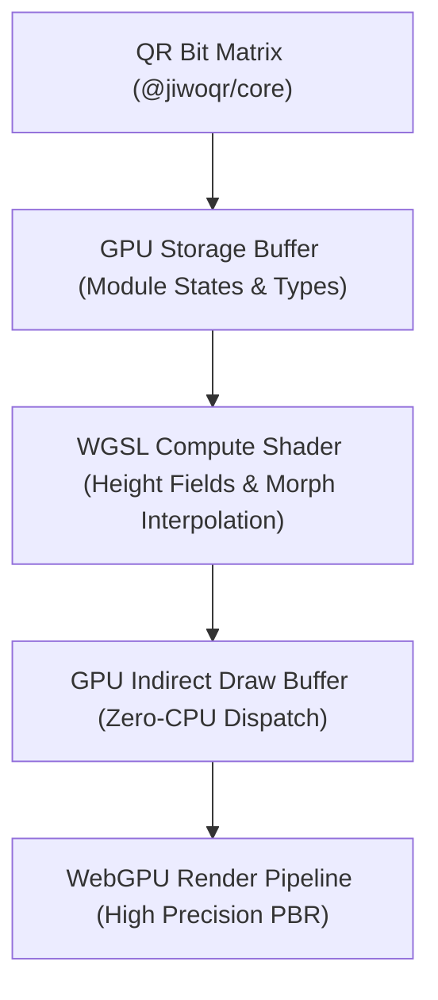

# ⚡ @jiwoqr/renderer-webgpu

> **Scaffolding & Kontrak Pipeline WebGPU Generasi Mendatang**  
> *Arsitektur masa depan untuk generator QR 3D JiwoQR berbasis WebGPU API dan WGSL Compute Shaders untuk simulasi jutaan voxel pada 120 FPS.*

[](file:///d:/REPOS/jiwoQR/packages/renderer-webgpu)
[](https://www.w3.org/TR/webgpu/)
[](file:///d:/REPOS/jiwoQR/packages/renderer-webgpu)

---

## 📖 Daftar Isi

- [Gambaran Umum](#-gambaran-umum)
- [Visi Arsitektur WebGPU](#-visi-arsitektur-webgpu)
- [API & Helper Saat Ini](#-api--helper-saat-ini)
- [Roadmap Pengembangan](#-roadmap-pengembangan)

---

## 🌟 Gambaran Umum

Paket `@jiwoqr/renderer-webgpu` adalah fondasi arsitektur tahap berikutnya untuk ekosistem JiwoQR. Dengan memanfaatkan standar baru **WebGPU**, rendering 3D prosedural akan bergeser dari CPU-driven instancing ke **GPU Compute Shaders (WGSL)** murni.

---

## 🚀 Visi Arsitektur WebGPU



Keuntungan arsitektur WebGPU:
1. **Parallel Compute Interpolation**: Perhitungan posisi morphing dan kurva easing ribuan modul dihitung paralel di GPU Compute Shader.
2. **Indirect Instanced Drawing**: Menghilangkan overhead sinkronisasi CPU-to-GPU pada setiap frame.
3. **Pencahayaan Ray-traced Masa Depan**: Efek pantulan logam brutalist dan ambient occlusion yang lebih presisi.

---

## 💻 API & Helper Saat Ini

### Deteksi Dukungan Peramban (`isWebGPUSupported`)

```typescript
import { isWebGPUSupported } from '@jiwoqr/renderer-webgpu';

if (isWebGPUSupported()) {
  console.log('Peramban mendukung WebGPU!');
} else {
  console.log('Fallback ke WebGL renderer (@jiwoqr/renderer-webgl)');
}
```

### Tipe Data Interface

```typescript
export type WebGPURenderModel = 'architecture' | 'globe';
export type WebGPURenderMode = '3d' | 'scan';

export interface JiwoWebGPUOptions {
  canvas?: HTMLCanvasElement;
  container?: HTMLElement;
  model?: WebGPURenderModel;
  mode?: WebGPURenderMode;
  morphDuration?: number;
  powerPreference?: 'low-power' | 'high-performance';
}
```

---

## 🗺️ Roadmap Pengembangan

- [x] **Fase 1**: Definisi tipe data dasar dan fungsi deteksi fitur WebGPU (`isWebGPUSupported`).
- [ ] **Fase 2**: Implementasi WGSL compute shader untuk kalkulasi transformasi modul dan kurva `easeInOutCubic`.
- [ ] **Fase 3**: Render pipeline WebGPU native dengan depth testing dan dynamic shadow mapping.
- [ ] **Fase 4**: Auto-fallback cerdas (WebGPU $\to$ WebGL) di wrapper komponen React dan Web Component.
