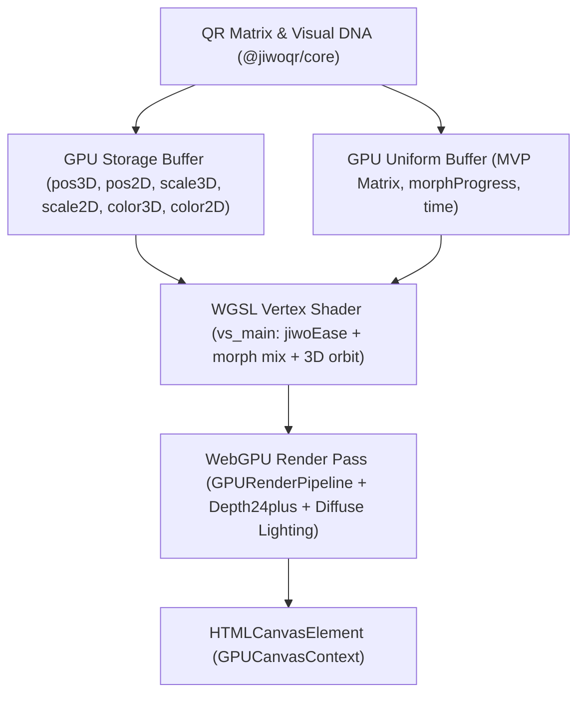

# ⚡ @jiwoqr/renderer-webgpu

> **Pipeline WebGPU Native & WGSL Shader Engine Generasi Mendatang**  
> *Arsitektur rendering native WebGPU untuk generator QR 3D JiwoQR berbasis W3C WebGPU API, WGSL vertex/compute shaders, storage buffer instanced rendering, dan zero-CPU morph interpolation 120 FPS.*

[](file:///d:/REPOS/jiwoQR/packages/renderer-webgpu)
[](https://www.w3.org/TR/webgpu/)
[](file:///d:/REPOS/jiwoQR/packages/renderer-webgpu)

---

## 📖 Daftar Isi

- [Gambaran Umum](#-gambaran-umum)
- [Arsitektur Pipeline Native WebGPU](#-arsitektur-pipeline-native-webgpu)
- [Fitur Utama](#-fitur-utama)
- [Panduan Penggunaan (`JiwoWebGPURenderer`)](#-panduan-penggunaan-jiwowebgpurenderer)
- [Spesifikasi Shader WGSL](#-spesifikasi-shader-wgsl)
- [Struktur Tipe Data & Interface](#-struktur-tipe-data--interface)
- [Roadmap Perkembangan](#-roadmap-perkembangan)

---

## 🌟 Gambaran Umum

Paket `@jiwoqr/renderer-webgpu` adalah mesin rendering hardware-accelerated first-class yang beroperasi langsung di atas W3C WebGPU API murni tanpa ketergantungan library pihak ketiga. Seluruh interpolasi $t \in [0.0 \dots 1.0]$ untuk perubahan arketipe 3D menuju QR scan 2D dihitung secara langsung di dalam GPU Vertex Shader memanfaatkan **Storage Buffer** dan fungsi easing polinomial kubik native WGSL.

---

## 🚀 Arsitektur Pipeline Native WebGPU



Keuntungan arsitektur WebGPU:
1. **Parallel Morph Interpolation**: Perhitungan posisi morphing ribuan modul QR dihitung secara paralel di GPU.
2. **Storage Buffer Instancing**: Seluruh matriks dan atribut warna ditransmisikan dalam struktur packed float32 96-byte terarah.
3. **Zero-CPU Overhead**: CPU hanya memperbarui uniform time dan morphProgress ($< 0.001\text{ ms}$).

---

## 💻 Panduan Penggunaan (`JiwoWebGPURenderer`)

### 1. Inisialisasi & Rendering Native WebGPU

```typescript
import { JiwoWebGPURenderer, isWebGPUSupported } from '@jiwoqr/renderer-webgpu';

if (isWebGPUSupported()) {
  const container = document.getElementById('canvas-container')!;
  
  // Inisialisasi renderer native WebGPU
  const renderer = new JiwoWebGPURenderer({
    container,
    powerPreference: 'high-performance',
    morphDuration: 800,
  });

  // Muat URL atau payload QR
  renderer.setData('https://jiwoqr.dev');

  // Transisi halus ke mode pemindaian 2D
  renderer.setMode('scan');
} else {
  console.warn('WebGPU tidak didukung, gunakan @jiwoqr/renderer-webgl');
}
```

---

## ⚡ Spesifikasi Shader WGSL

File shader `packages/renderer-webgpu/src/shaders/architecture.wgsl.ts` mengekspor pipeline shader terpadu:

```wgsl
struct Uniforms {
  mvpMatrix: mat4x4<f32>,
  morphProgress: f32,
  time: f32,
  pad0: f32,
  pad1: f32,
};

struct ModuleInstance {
  pos3D: vec4<f32>,
  pos2D: vec4<f32>,
  scale3D: vec4<f32>,
  scale2D: vec4<f32>,
  color3D: vec4<f32>,
  color2D: vec4<f32>,
};

@group(0) @binding(0) var<uniform> uniforms: Uniforms;
@group(0) @binding(1) var<storage, read> instances: array<ModuleInstance>;
```

---

## 📐 Struktur Tipe Data & Interface

```typescript
export type WebGPUPowerPreference = 'low-power' | 'high-performance';
export type WebGPURenderModel = 'architecture';

export interface WebGPURendererOptions {
  canvas?: HTMLCanvasElement;
  container?: HTMLElement;
  device?: unknown;
  powerPreference?: WebGPUPowerPreference;
  morphDuration?: number;
  model?: WebGPURenderModel;
}

export interface WebGPURendererPipeline {
  initialize(options: { canvas: HTMLCanvasElement; powerPreference?: WebGPUPowerPreference; device?: unknown }): Promise<void>;
  dispose(): void;
}
```

---

## 🗺️ Roadmap Perkembangan

- [x] **Fase 1**: Definisi tipe data dasar dan fungsi deteksi fitur WebGPU (`isWebGPUSupported`).
- [x] **Fase 2**: Implementasi WGSL vertex & fragment shader untuk interpolasi 3D-ke-2D real-time model Architecture.
- [x] **Fase 3**: Integrasi Storage Buffer instancing, depth testing 24-bit, orbit camera matrix math mandiri (`mat4.ts`), dan toggle engine di `apps/demo`.
- [ ] **Fase 4**: Perluasan arketipe WGSL shader untuk Model 2-6 (`globe`, `circuit`, `biomorphic`, `city`, `origami`).
- [ ] **Fase 5**: Compute pass untuk dynamic raymarching dan soft shadows di WebGPU.

